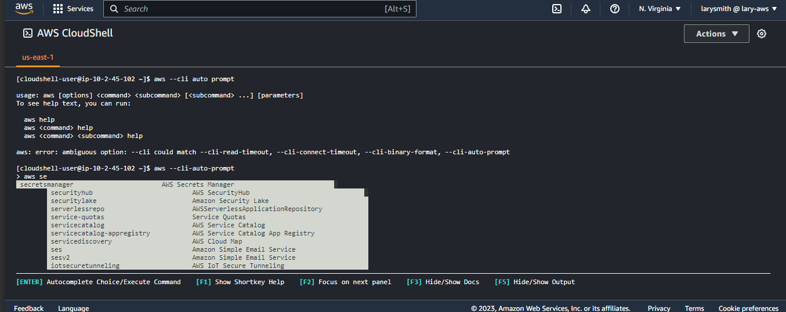
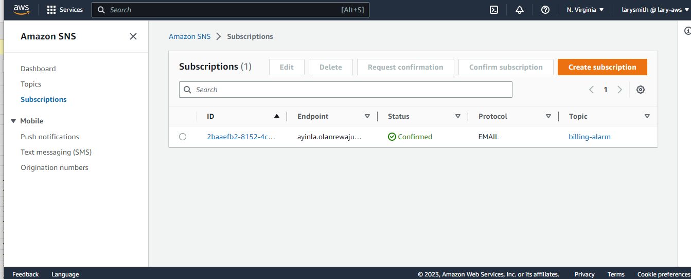
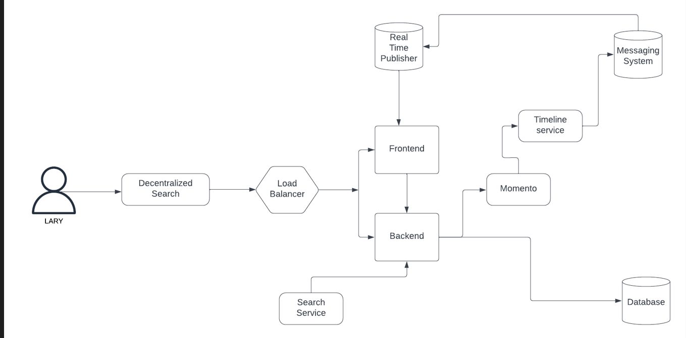
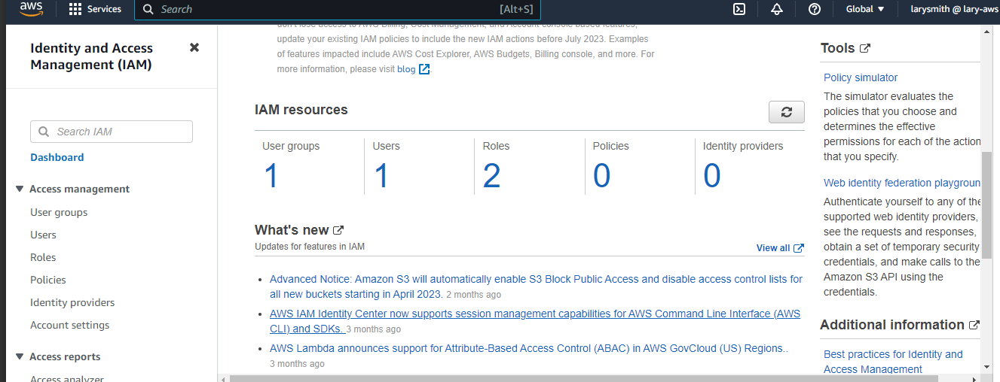

# Week 0 — Billing and Architecture
## Tasks completed for week 0
***
### Home-work hard assignment 
1. Successfully created an admin user

5. Succesfully used my aws cloudshell 

2. Generated the aws credentals of the user

3. I created a billing alarm as shown below;

4. Created a budget for the bootcamp.

5. Installed aws cli

4. Kindly find below an image of my conceptual diagram in a napkin. 

* To view on the lucid app, click [HERE](https://lucid.app/lucidchart/2db6558a-feed-41e8-b453-1188782c2c78/edit?viewport_loc=-122%2C192%2C2380%2C1022%2C0_0&invitationId=inv_06a8a74a-bcfc-4157-86d1-9f33763ab1df)

### Home-work stretch assignment
* An IAM role role, and the root account credentials was destroyed

* Used eventbridge to hookup health dashboard to SNS that sends notification when there is a service health issue. 

* Reviewed some questions of each pillar of the well architected tool

* Created a logical flow of the cruddr app, click [HERE](https://lucid.app/lucidchart/4e69d912-85e0-4f42-9f62-7763c0e6f8be/edit?viewport_loc=104%2C-73%2C2348%2C940%2C0_0&invitationId=inv_658a9e00-e396-4cf9-a9f1-0494424f80e8) to view.

* Made a few research on the technical and service limits of some services such as RDS, MQ, Route 53, EC2 instances, Dynamo DB etc.
