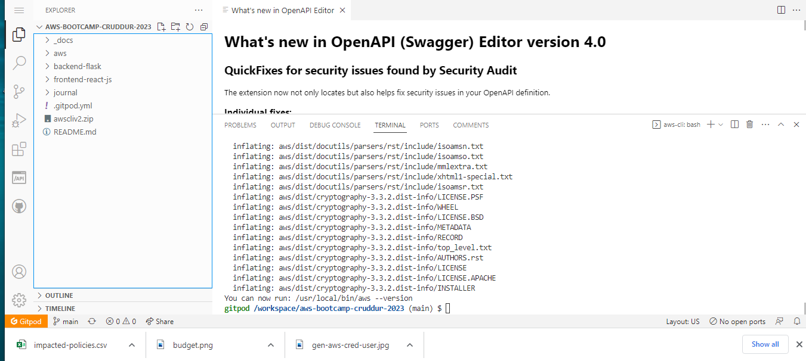

# Week 0 — Billing and Architecture
## Tasks completed for week 0
***
### Home-work hard assignment 

1. Succesfully used my aws cloudshell  
    

2. Created a budget for the bootcamp.  
    

3. Installed aws cli  
    

4. Kindly find below an image of my conceptual diagram in a napkin.  

* To view on the lucid app, click [HERE](https://lucid.app/lucidchart/2db6558a-feed-41e8-b453-1188782c2c78/edit?viewport_loc=-122%2C192%2C2380%2C1022%2C0_0&invitationId=inv_06a8a74a-bcfc-4157-86d1-9f33763ab1df)    

5. An IAM role role, and the root account credentials was destroyed  
    

6. Used eventbridge to hookup health dashboard to SNS that sends notification when there is a service health issue.  

7. Reviewed some questions of each pillar of the well architected tool

